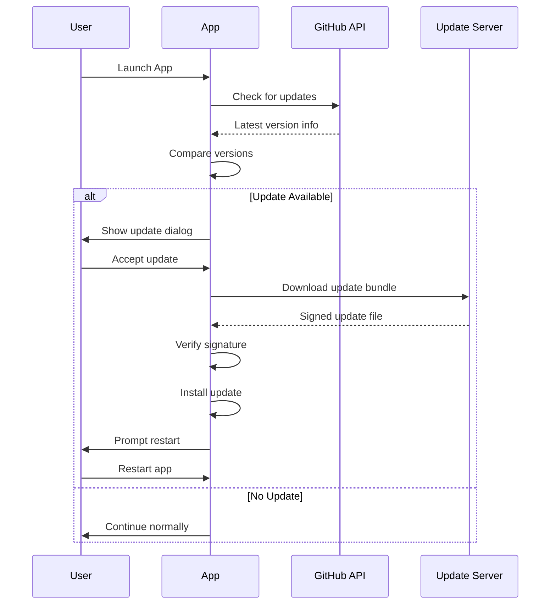

# Phosphobot Desktop (Tauri App)

A cross-platform desktop application built with [Tauri v2](https://v2.tauri.app/) that provides a native interface for the Phosphobot robotics development kit.

## 📚 Table of Contents

- [🏗️ Architecture Overview](#️-architecture-overview)
- [📋 Prerequisites](#-prerequisites)
- [🚀 Quick Start](#-quick-start)
- [🛠️ Development Workflow](#️-development-workflow)
- [🐍 Python Sidecar Integration](#-python-sidecar-integration)
- [🔄 Auto-Updater System](#-auto-updater-system)
- [📦 Version Management](#-version-management)
- [🔐 Code Signing & Distribution](#-code-signing--distribution)
- [🚨 Security Considerations](#-security-considerations)
- [🐛 Troubleshooting](#-troubleshooting)
- [🎯 Best Practices](#-best-practices)
- [🚀 Quick Start Checklist](#-quick-start-checklist)
- [🔧 Advanced Configuration](#-advanced-configuration)
- [📚 Additional Resources](#-additional-resources)
- [🤝 Contributing](#-contributing)

## 🏗️ Architecture Overview

This application follows Tauri's hybrid architecture:

- **Frontend**: React-based dashboard (in `../dashboard/`)
- **Backend**: Rust application with Tauri plugins 
- **Sidecar**: Python application (`phosphobot`) bundled as a native binary
- **Communication**: Frontend ↔ Rust ↔ Python via HTTP API

```
┌─────────────────┐    ┌──────────────────┐    ┌─────────────────┐
│   React App     │    │   Rust Backend   │    │  Python Sidecar │
│   (Dashboard)   │◄──►│   (Tauri Core)   │◄──►│   (Phosphobot)  │
│                 │    │                  │    │                 │
│  - UI Controls  │    │  - Window Mgmt   │    │  - Robot APIs   │
│  - Status View  │    │  - File System   │    │  - AI Control   │
│  - Settings     │    │  - Auto-Updater  │    │  - Camera Mgmt  │
└─────────────────┘    └──────────────────┘    └─────────────────┘
```

### Key Features

- 🚀 Native performance with web technology UI
- 🔄 Automatic updates with cryptographic signing
- 🐍 Embedded Python application (no Python installation required)
- 📱 Cross-platform: macOS, Windows, Linux
- 🔐 Security-first design with capability-based permissions

## 📋 Prerequisites

### Development Environment

1. **Rust** (latest stable)
   ```bash
   curl --proto '=https' --tlsv1.2 -sSf https://sh.rustup.rs | sh
   ```

2. **Node.js** (LTS version)
   ```bash
   # Using nvm (recommended)
   nvm install --lts
   nvm use --lts
   ```

3. **Python 3.10+** with [uv](https://docs.astral.sh/uv/)
   ```bash
   curl -LsSf https://astral.sh/uv/install.sh | sh
   ```

4. **Platform-specific dependencies**:

   **macOS**:
   ```bash
   xcode-select --install
   ```

   **Linux (Ubuntu/Debian)**:
   ```bash
   sudo apt update
   sudo apt install libwebkit2gtk-4.1-dev libappindicator3-dev librsvg2-dev patchelf
   ```

   **Windows**:
   - Install [Microsoft C++ Build Tools](https://visualstudio.microsoft.com/visual-cpp-build-tools/)
   - Install [WebView2](https://developer.microsoft.com/en-us/microsoft-edge/webview2/)

## 🚀 Quick Start

### 1. Install Dependencies

```bash
# Install Tauri CLI and frontend dependencies
npm install
npm run dashboard:install

# Install Python dependencies and build tools
cd ../phosphobot
uv sync
uv tool install hatch
uv tool install box-packager
cd ../src-tauri
```

### 2. Development Mode

```bash
# Start development server (auto-reload enabled)
npm run dev

# This will:
# 1. Start the React development server (port 5173)
# 2. Build the Python sidecar if needed
# 3. Launch the Tauri app with hot-reload
```

### 3. Production Build

```bash
# Build everything for production
npm run build

# This creates:
# - Signed application bundles in target/release/bundle/
# - Platform-specific installers (DMG, MSI, DEB, AppImage)
```

## 🛠️ Development Workflow

### Project Structure

```
src-tauri/
├── src/                        # Rust source code
│   ├── main.rs                 # Application entry point
│   └── state.rs                # Global application state
├── capabilities/               # Tauri security permissions
│   ├── default.json            # Core app permissions
│   └── http.json               # HTTP client permissions
├── scripts/                    # Build and utility scripts
│   ├── build-python.mjs        # Python sidecar bundling
│   ├── generate-updater-keys.mjs # Update signing keys
│   └── ...
├── binaries/                   # Bundled Python executables
├── icons/                      # Application icons
├── tauri.conf.json            # Tauri configuration
├── Cargo.toml                 # Rust dependencies
└── package.json               # Node.js dependencies and scripts
```

### Available Scripts

```bash
# Development
npm run dev                     # Start dev server with hot-reload
npm run dashboard:dev           # Start frontend only
npm run python:package:dev      # Start Python backend only

# Building
npm run build                   # Full production build
npm run dashboard:build         # Build frontend only
npm run python:package:build    # Build Python sidecar only

# Python Sidecar Management
npm run python:package:check    # Check if Python rebuild needed
npm run python:package:build:if-needed  # Conditional build
npm run python:package:reset    # Reset Python package state

# Utilities
npm run clean                   # Clean all build artifacts
npm run updater:generate-keys   # Generate update signing keys
```

## 🐍 Python Sidecar Integration

The app includes a Python application as a "sidecar" - a separate process that runs alongside the main app.

### How It Works

1. **Bundling**: Python app is packaged into a single executable using [PyApp](https://ofek.dev/pyapp/) via [Box](https://pypi.org/project/box-packager/)
2. **Distribution**: Bundled executable is embedded in the Tauri app
3. **Runtime**: Tauri spawns the Python process and communicates via HTTP
4. **Lifecycle**: Python process is automatically managed (start/stop/restart)

### Build Process

```bash
# The Python build process:
cd ../phosphobot
uv sync                         # Install dependencies
uvx --from box-packager box package  # Bundle into executable
# Creates: target/release/phosphobot (or .exe on Windows)
```

### Cross-Platform Considerations

- **macOS**: Universal binaries supported (Intel + Apple Silicon)
- **Windows**: Handles both x64 and ARM64 architectures
- **Linux**: Uses AppImage for maximum compatibility
- **Dependencies**: All Python dependencies bundled (no system Python required)

## 🔄 Auto-Updater System

### Overview

The app includes automatic updates using Tauri's built-in updater with cryptographic signature verification.

### How Updates Work

1. **Check**: App checks GitHub releases API on startup
2. **Download**: If newer version available, downloads signed bundle
3. **Verify**: Cryptographically verifies signature before installation
4. **Install**: Replaces app files and prompts for restart
5. **Restart**: User can restart to complete update

### Setup Updater

1. **Generate signing keys**:
   ```bash
   npm run updater:generate-keys
   ```

2. **Configure environment**:
   ```bash
   cp .env.example .env
   # Edit .env with your key paths
   ```

3. **Add to tauri.conf.json** (done automatically):
   ```json
   {
     "plugins": {
       "updater": {
         "active": true,
         "endpoints": ["https://api.github.com/repos/phospho-app/phosphobot/releases/latest"],
         "dialog": true,
         "pubkey": "your-public-key-here"
       }
     }
   }
   ```

### Security Model

- **Ed25519 signatures**: Industry-standard cryptographic signing
- **Public key verification**: Built into the app, cannot be bypassed
- **HTTPS only**: All update downloads use secure transport
- **User consent**: Built-in dialogs require user approval

### Update Process Flow



### Version Comparison Logic

The updater compares versions using semantic versioning rules:

```javascript
// Examples of version comparisons:
"0.3.52" < "0.3.53" → Update available
"0.3.53" < "0.4.0"  → Update available  
"0.4.0" < "1.0.0"   → Update available
"1.0.0" = "1.0.0"   → No update
"1.0.1" > "1.0.0"   → User has newer version (beta/dev)
```

### Update Configuration

The updater is configured in `tauri.conf.json`:

```json
{
  "plugins": {
    "updater": {
      "active": true,
      "endpoints": [
        "https://api.github.com/repos/phospho-app/phosphobot/releases/latest"
      ],
      "dialog": true,
      "pubkey": "dW50cnVzdGVkIGNvbW1lbnQ6IG1pbmlzaWduIHB1YmxpYyBrZXkgOEI0RUY..."
    }
  }
}
```

**Configuration Options**:
- **`active`**: Enable/disable the updater
- **`endpoints`**: Array of URLs to check for updates
- **`dialog`**: Use built-in dialogs (set to `true` for automatic handling)
- **`pubkey`**: Public key for signature verification (auto-generated)

## 📦 Version Management

### How Versioning Works

The Phosphobot Desktop application uses a **synchronized versioning system** where the version number must be consistent across multiple configuration files:

1. **`src-tauri/tauri.conf.json`** - Main Tauri configuration (line 4)
2. **`src-tauri/package.json`** - Node.js package metadata (line 3)
3. **`phosphobot/pyproject.toml`** - Python package metadata (line 3)

**Version Format**: `MAJOR.MINOR.PATCH` (following [Semantic Versioning](https://semver.org/))

Example: `0.3.52` means:
- **Major**: 0 (breaking changes)
- **Minor**: 3 (new features, backward compatible)
- **Patch**: 52 (bug fixes, backward compatible)

### How to Update Version

**⚠️ Important**: All three files must have the **exact same version number** for builds to work correctly.

#### Step-by-Step Manual Update

1. **Update `src-tauri/tauri.conf.json`**:
   ```json
   {
     "version": "0.3.53",  // ← Change this line
     // ... rest of config
   }
   ```

2. **Update `src-tauri/package.json`**:
   ```json
   {
     "name": "phosphobot-desktop",
     "version": "0.3.53",  // ← Change this line
     // ... rest of package
   }
   ```

3. **Update `phosphobot/pyproject.toml`**:
   ```toml
   [project]
   name = "phosphobot"
   version = "0.3.53"  # ← Change this line
   # ... rest of config
   ```

#### Quick sed Commands (Optional)

If you prefer using command line tools:

```bash
# Replace 0.3.52 with your new version
NEW_VERSION="0.3.53"
OLD_VERSION="0.3.52"

# Update all three files
sed -i.bak "s/\"version\": \"$OLD_VERSION\"/\"version\": \"$NEW_VERSION\"/g" src-tauri/tauri.conf.json
sed -i.bak "s/\"version\": \"$OLD_VERSION\"/\"version\": \"$NEW_VERSION\"/g" src-tauri/package.json
sed -i.bak "s/version = \"$OLD_VERSION\"/version = \"$NEW_VERSION\"/g" phosphobot/pyproject.toml

# Clean up backup files
rm src-tauri/tauri.conf.json.bak src-tauri/package.json.bak phosphobot/pyproject.toml.bak
```

### Version Update Workflow

1. **Update version numbers** in all three files (ensure they match exactly)
2. **Verify synchronization**:
   ```bash
   # Check all versions match
   echo "Tauri config: $(grep -o '"version": "[^"]*"' src-tauri/tauri.conf.json | cut -d'"' -f4)"
   echo "Package.json: $(grep -o '"version": "[^"]*"' src-tauri/package.json | cut -d'"' -f4)"
   echo "Python package: $(grep -o 'version = "[^"]*"' phosphobot/pyproject.toml | cut -d'"' -f2)"
   ```
3. **Test the build** locally:
   ```bash
   npm run build
   ```
4. **Commit the changes**:
   ```bash
   git add .
   git commit -m "bump version to 0.3.53"
   ```
5. **Create a git tag** (optional but recommended):
   ```bash
   git tag v0.3.53
   ```
6. **Push to trigger release**:
   ```bash
   git push origin main --tags
   ```

### How GitHub Actions Uses Version

The GitHub Actions workflow automatically:

1. **Checks version synchronization** across all three files
2. **Fails the build** if versions don't match
3. **Reads version** from `src-tauri/tauri.conf.json`
4. **Creates release tag** as `phosphobot-v{VERSION}` (e.g., `phosphobot-v0.3.53`)
5. **Builds signed binaries** for all platforms
6. **Creates GitHub release** with auto-generated notes
7. **Publishes to Homebrew** (if configured)

The workflow uses Tauri's `__VERSION__` placeholder which gets replaced automatically:
```yaml
tagName: phosphobot-v__VERSION__  # becomes phosphobot-v0.3.53
releaseName: 'Phosphobot Desktop v__VERSION__'  # becomes 'Phosphobot Desktop v0.3.53'
```

### Version Consistency Verification

To verify all versions are synchronized:

```bash
# Check all versions match
echo "Tauri config: $(grep -o '"version": "[^"]*"' src-tauri/tauri.conf.json | cut -d'"' -f4)"
echo "Package.json: $(grep -o '"version": "[^"]*"' src-tauri/package.json | cut -d'"' -f4)"
echo "Python package: $(grep -o 'version = "[^"]*"' phosphobot/pyproject.toml | cut -d'"' -f2)"
```

Expected output:
```
Tauri config: 0.3.53
Package.json: 0.3.53
Python package: 0.3.53
```

If any versions don't match, the GitHub Actions build will fail with a clear error message.

### Troubleshooting Version Issues

**Build fails with version mismatch**:
- Ensure all three files have the same version number
- Check for typos in version strings
- Verify JSON/TOML syntax is correct

**Updates not working**:
- Verify new version is higher than current installed version
- Check that updater keys are properly configured
- Ensure GitHub release was created successfully

**Auto-updater not triggered**:
- Version must be **higher** than currently installed version
- Updater only checks for updates on app startup
- Check network connectivity and GitHub API access

## 🔐 Code Signing & Distribution

### Getting Required Certificates and Keys

#### Apple Developer Setup (macOS Code Signing)

**Requirements**:
- Apple Developer Account ($99/year)
- macOS machine for certificate management

**Step-by-step setup**:

1. **Join Apple Developer Program**:
   - Go to [developer.apple.com](https://developer.apple.com)
   - Sign up for Apple Developer Program ($99/year)
   - Wait for approval (usually 24-48 hours)

2. **Create Developer ID Certificate**:
   - Log in to [Apple Developer Console](https://developer.apple.com/account/)
   - Go to **Certificates, Identifiers & Profiles**
   - Click **Certificates** → **Create New Certificate**
   - Select **Developer ID Application** (for distribution outside Mac App Store)
   - Follow the prompts to create a Certificate Signing Request (CSR)
   - Download the certificate and install it in **Keychain Access**

3. **Get App-Specific Password**:
   - Go to [appleid.apple.com](https://appleid.apple.com)
   - Sign in with your Apple ID
   - Go to **Security** → **App-Specific Passwords**
   - Click **Generate Password**
   - Label it "Phosphobot Notarization"
   - Save the generated password securely

4. **Find Your Team ID**:
   - In Apple Developer Console, go to **Membership**
   - Your **Team ID** is the 10-character alphanumeric string

5. **Export Certificate for CI/CD**:
   ```bash
   # In Keychain Access:
   # 1. Find your "Developer ID Application" certificate
   # 2. Right-click → Export
   # 3. Choose .p12 format
   # 4. Set a strong password
   # 5. Save as certificate.p12
   
   # Convert to base64 for GitHub secrets
   base64 -i certificate.p12 | pbcopy
   ```

**Required GitHub Secrets**:
```bash
APPLE_CERTIFICATE          # Base64 content of .p12 file
APPLE_CERTIFICATE_PASSWORD # Password you set for .p12 file
APPLE_ID                   # Your Apple ID email
APPLE_PASSWORD             # App-specific password from appleid.apple.com
APPLE_TEAM_ID              # 10-character team ID from developer console
```

#### Windows Code Signing Setup

**Requirements**:
- Code signing certificate from trusted Certificate Authority
- Windows machine for certificate management (or cross-platform tools)

**Recommended Certificate Authorities**:
- **DigiCert** (most common, $300-600/year)
- **Sectigo** (formerly Comodo, $200-400/year)
- **GlobalSign** ($250-500/year)

**Step-by-step setup**:

1. **Purchase Certificate**:
   - Choose **Code Signing Certificate** (not EV unless required)
   - **Organization Validated (OV)** is sufficient for most cases
   - **Extended Validation (EV)** provides more trust but requires hardware token

2. **Certificate Validation**:
   - CA will verify your organization (2-7 business days)
   - You'll receive certificate files via email
   - Install certificate in Windows Certificate Store

3. **Export Certificate for CI/CD**:
   ```bash
   # On Windows, using PowerShell:
   # 1. Open Certificate Manager (certmgr.msc)
   # 2. Find your certificate in Personal → Certificates
   # 3. Right-click → All Tasks → Export
   # 4. Choose .p12/.pfx format with private key
   # 5. Set a strong password
   
   # Convert to base64 for GitHub secrets
   [Convert]::ToBase64String([IO.File]::ReadAllBytes("certificate.p12")) | clip
   ```

**Required GitHub Secrets** (Windows code signing currently disabled):
```bash
WINDOWS_CERTIFICATE          # Base64 content of .p12/.pfx file
WINDOWS_CERTIFICATE_PASSWORD # Password you set for certificate
```

#### Tauri Updater Keys Setup

**Generate updater signing keys**:

1. **Generate keys locally**:
   ```bash
   cd src-tauri
   npm run updater:generate-keys
   ```

2. **This creates**:
   - `updater-keys/phosphobot.key` (private key) - **NEVER COMMIT THIS**
   - `updater-keys/phosphobot.pub` (public key) - gets added to tauri.conf.json
   - Updates `tauri.conf.json` with public key automatically

3. **For GitHub Actions**:
   ```bash
   # Copy the ENTIRE content of the private key file
   cat updater-keys/phosphobot.key | pbcopy
   ```

**Required GitHub Secrets**:
```bash
TAURI_SIGNING_PRIVATE_KEY           # Complete content of phosphobot.key file
TAURI_SIGNING_PRIVATE_KEY_PASSWORD  # Password if you set one (usually empty)
```

#### Setting up GitHub Secrets

1. **Go to your repository on GitHub**
2. **Navigate to Settings → Secrets and variables → Actions**
3. **Click "New repository secret"**
4. **Add each secret with the exact names listed above**

**Complete list of required secrets**:
```bash
# Core (always required)
GITHUB_TOKEN                    # Auto-provided by GitHub

# Apple Code Signing (ENABLED - for macOS)
APPLE_CERTIFICATE               # Base64 .p12 file content
APPLE_CERTIFICATE_PASSWORD      # Certificate password
APPLE_ID                        # Apple ID email
APPLE_PASSWORD                  # App-specific password
APPLE_TEAM_ID                   # 10-character team ID
KEYCHAIN_PASSWORD               # Password for build keychain

# Windows Code Signing (DISABLED - uncomment in workflow to enable)
# WINDOWS_CERTIFICATE             # Base64 .p12/.pfx file content
# WINDOWS_CERTIFICATE_PASSWORD    # Certificate password

# Tauri Auto-Updater (for all platforms)
TAURI_SIGNING_PRIVATE_KEY           # Complete private key file content
TAURI_SIGNING_PRIVATE_KEY_PASSWORD  # Key password (usually empty)

# Optional - Homebrew Distribution
HOMEBREW_TAP_TOKEN             # GitHub token for homebrew-tap repo
```

### Testing Your Setup

**Test certificates locally**:
```bash
# Test Apple certificate
security find-identity -v -p codesigning

# Test Windows certificate (on Windows)
certutil -store -user my

# Test Tauri updater keys
ls -la updater-keys/
```

**Test build with signing**:
```bash
npm run build
```

**Verify signed artifacts**:
```bash
# macOS
codesign -dv --verbose=4 target/release/bundle/macos/Phosphobot.app

# Windows (on Windows)
signtool verify /pa target/release/bundle/msi/Phosphobot_0.3.53_x64_en-US.msi
```

### Cost Breakdown

**Annual costs for full code signing setup**:
- **Apple Developer Account**: $99/year
- **Windows Code Signing Certificate**: $200-600/year
- **Total**: ~$300-700/year

**Free alternatives**:
- **Self-signed certificates**: Free but users get security warnings
- **No signing**: Free but users get "Unknown Developer" warnings
- **Linux**: No signing required

### Security Best Practices

1. **Certificate Security**:
   - Use strong passwords for certificate files
   - Store certificates in secure locations
   - Never commit certificates to version control
   - Regularly backup certificates

2. **Key Management**:
   - Generate updater keys on secure machine
   - Backup private keys securely
   - Use password managers for secrets
   - Rotate keys periodically

3. **GitHub Secrets**:
   - Use least-privilege access
   - Regularly audit secrets
   - Remove unused secrets
   - Use environment-specific secrets if needed

## 🚨 Security Considerations

### Code Signing Importance

1. **User Trust**: Prevents "Unknown Developer" warnings
2. **Malware Protection**: OS-level verification of app integrity
3. **Auto-Updates**: Required for seamless update experience
4. **Distribution**: Required for Mac App Store, recommended for others

### Best Practices

1. **Certificate Security**:
   - Store certificates securely (password managers)
   - Use strong passwords
   - Regular certificate renewal
   - Separate development/production certificates

2. **Key Management**:
   - Never commit private keys to version control
   - Use environment variables or secret management
   - Regular key rotation for update signing
   - Backup keys securely

3. **Update Security**:
   - Always verify signatures before installation
   - Use HTTPS for all update communications
   - Test updates in staging environment
   - Monitor for failed signature verifications

## 🐛 Troubleshooting

### Common Issues

**Build Failures**:
```bash
# Clean everything and rebuild
npm run clean
rm -rf node_modules ../dashboard/node_modules
npm install
npm run dashboard:install
npm run build
```

**Python Sidecar Issues**:
```bash
# Rebuild Python package
npm run python:package:build
# Test the binary
./binaries/phosphobot --help
```

**Code Signing Issues**:
```bash
# Verify certificate is valid
security find-identity -v -p codesigning

# Check certificate expiration
security find-certificate -a -c "Developer ID Application" -p | openssl x509 -text
```

**Update Issues**:
```bash
# Verify public key matches private key
npm run updater:generate-keys --verify
```

### Debug Mode

Enable debug logging:
```bash
# Set environment variable
export RUST_LOG=debug
npm run dev
```

### Update Testing

Test updates locally:

```bash
# 1. Build current version
npm run build

# 2. Install built app
# macOS: Open target/release/bundle/macos/Phosphobot.app
# Windows: Install target/release/bundle/msi/Phosphobot_*.msi
# Linux: Install target/release/bundle/deb/phosphobot_*.deb

# 3. Update version number
# Edit src-tauri/tauri.conf.json: "version": "0.3.55"

# 4. Build new version
npm run build

# 5. Create local test release
# Upload artifacts to GitHub release manually

# 6. Launch installed app
# Should detect and offer update
```

## 🎯 Best Practices

### Version Management
- ✅ Always update all three files together
- ✅ Use semantic versioning (MAJOR.MINOR.PATCH)
- ✅ Test builds before releasing
- ✅ Create git tags for releases
- ✅ Verify version sync before pushing

### Security
- ✅ Never commit private keys to version control
- ✅ Use strong passwords for certificate files
- ✅ Backup keys securely (password managers, encrypted vaults)
- ✅ Rotate keys periodically (annual recommended)
- ✅ Use least-privilege access for GitHub secrets

### Release Process
- ✅ Test locally first on all target platforms
- ✅ Include clear release notes in GitHub releases
- ✅ Monitor update adoption rates
- ✅ Set up error alerts for failed updates
- ✅ Don't force immediate restarts

### User Experience
- ✅ Keep update downloads small when possible
- ✅ Provide clear release notes
- ✅ Test update UX on all platforms
- ✅ Handle network failures gracefully

## 🚀 Quick Start Checklist

### For Development (Free)
- [ ] Clone repository and install dependencies
- [ ] Generate updater keys: `npm run updater:generate-keys`
- [ ] Test build locally: `npm run build`
- [ ] Update version manually in all three files when releasing

### For Production (Paid)
- [ ] Get Apple Developer account ($99/year)
- [ ] Get Windows code signing certificate ($200-600/year)
- [ ] Export certificates to base64 format
- [ ] Add all required GitHub secrets
- [ ] Test full release process with signing

### For Each Release
- [ ] Update version in all three files manually
- [ ] Verify versions match with verification commands
- [ ] Test build locally: `npm run build`
- [ ] Commit changes: `git add . && git commit -m "bump version to X.Y.Z"`
- [ ] Create git tag: `git tag vX.Y.Z`
- [ ] Push to trigger GitHub Actions: `git push origin main --tags`
- [ ] Monitor GitHub Actions workflow for success
- [ ] Verify GitHub release was created with proper assets
- [ ] Test update process with existing installation

## 🔧 Advanced Configuration

### Custom Update Servers

You can use custom update servers instead of GitHub:

```json
{
  "plugins": {
    "updater": {
      "endpoints": [
        "https://your-update-server.com/api/updates/check"
      ]
    }
  }
}
```

Your server should respond with:
```json
{
  "version": "0.3.53",
  "notes": "What's new in this version",
  "pub_date": "2024-01-15T12:00:00Z",
  "platforms": {
    "darwin-aarch64": {
      "signature": "base64-signature-here",
      "url": "https://your-server.com/updates/Phosphobot.app.tar.gz"
    }
  }
}
```

### Silent Updates

For enterprise deployments, you can configure silent updates:

```json
{
  "plugins": {
    "updater": {
      "dialog": false,  // Disable user prompts
      "silent": true    // Install automatically
    }
  }
}
```

### Multiple Update Channels

Support multiple update channels (stable, beta, dev):

```json
{
  "plugins": {
    "updater": {
      "endpoints": [
        "https://api.github.com/repos/phospho-app/phosphobot/releases/latest",
        "https://api.github.com/repos/phospho-app/phosphobot/releases/tags/beta"
      ]
    }
  }
}
```

## 🚀 GitHub Actions Publishing Setup

### Overview

The repository includes a comprehensive GitHub Actions workflow that automatically builds, signs, and publishes the application across all platforms. The workflow creates draft releases for manual review and publishing.

### Required GitHub Secrets

#### Core Publishing Secrets

1. **GITHUB_TOKEN** (automatically provided by GitHub)
   - Used for creating releases and uploading assets
   - No setup required - automatically available

#### macOS Code Signing (Optional but Recommended)

2. **APPLE_CERTIFICATE**
   - Base64 encoded Developer ID Application certificate (.p12 file)
   - Get from Apple Developer Portal
   ```bash
   base64 -i certificate.p12 | pbcopy
   ```

3. **APPLE_CERTIFICATE_PASSWORD**
   - Password for the .p12 certificate file

4. **KEYCHAIN_PASSWORD**
   - Password for the temporary build keychain (choose any strong password)

5. **APPLE_ID**
   - Your Apple ID email for notarization

6. **APPLE_PASSWORD**
   - App-specific password for your Apple ID
   - Generate at [appleid.apple.com](https://appleid.apple.com) → Security → App-Specific Passwords

7. **APPLE_TEAM_ID**
   - Your Apple Developer Team ID (10-character string)
   - Find in Apple Developer Portal → Membership

#### Windows Code Signing (Optional)

8. **WINDOWS_CERTIFICATE**
   - Base64 encoded code signing certificate (.p12 file)
   - Purchase from a Certificate Authority (DigiCert, Sectigo, etc.)
   ```bash
   base64 -i windows-cert.p12 | pbcopy
   ```

9. **WINDOWS_CERTIFICATE_PASSWORD**
   - Password for the Windows certificate

#### Tauri Auto-Updater (Required for Updates)

10. **TAURI_SIGNING_PRIVATE_KEY**
    - Private key for Tauri's built-in updater
    - Generate with: `npm run updater:generate-keys`

11. **TAURI_SIGNING_PRIVATE_KEY_PASSWORD**
    - Password for the Tauri signing key (usually empty)

#### Homebrew Distribution (Optional)

12. **HOMEBREW_TAP_TOKEN**
    - GitHub Personal Access Token with repo permissions
    - For publishing to a Homebrew tap repository
    - Only needed if you want automatic Homebrew cask updates

### Setting Up GitHub Secrets

1. Go to your GitHub repository
2. Navigate to **Settings** → **Secrets and variables** → **Actions**
3. Click **New repository secret**
4. Add each secret with the exact name listed above

### Workflow Features

#### Cross-Platform Builds
- **macOS**: ARM64 (Apple Silicon) and x86_64 (Intel)
- **Windows**: x86_64 with MSI and NSIS installers
- **Linux**: x86_64 with DEB packages and AppImage

#### Automatic Features
- ✅ Cross-platform Python package building with PyApp/Box
- ✅ **Code signing for macOS** (when Apple certificates provided)
- ✅ Code signing for Windows (when certificates provided - currently disabled)
- ✅ Automatic GitHub releases with detailed descriptions
- ✅ Standalone Python CLI binaries uploaded as release assets
- ✅ Homebrew cask generation (when configured)
- ✅ Dependency caching for faster builds
- ✅ Draft releases (manual publish required)
- ✅ Version synchronization verification

#### Generated Artifacts

**macOS**:
- `Phosphobot_x.x.x_aarch64.dmg` (Apple Silicon desktop app)
- `Phosphobot_x.x.x_x64.dmg` (Intel desktop app)
- `Phosphobot.app.tar.gz` files for updater
- `phosphobot-macos-aarch64` (standalone Python CLI binary)

**Windows**:
- `Phosphobot_x.x.x_x64_en-US.msi` (MSI installer)
- `Phosphobot_x.x.x_x64-setup.exe` (NSIS installer)
- `phosphobot-windows-x86_64.exe` (standalone Python CLI binary)

**Linux**:
- `phosphobot_x.x.x_amd64.deb` (Debian package)
- `phosphobot_x.x.x_amd64.AppImage` (Universal Linux)
- `phosphobot-linux-x86_64` (standalone Python CLI binary)

#### Standalone Python CLI Binaries

The workflow automatically generates standalone Python CLI binaries that can be used independently of the desktop application. These binaries:

- **No Python installation required**: Self-contained executables with all dependencies bundled
- **Direct robot control**: Full access to all Phosphobot CLI commands and APIs
- **Lightweight**: Smaller download size compared to the full desktop app
- **Scriptable**: Perfect for automation, CI/CD, or headless environments
- **Cross-platform**: Native binaries for macOS (Apple Silicon), Windows (x64), and Linux (x64)

Usage example:
```bash
# Download the binary for your platform
chmod +x phosphobot-linux-x86_64  # Linux/macOS only
./phosphobot-linux-x86_64 --help

# Windows
phosphobot-windows-x86_64.exe --help
```

### Triggering Builds

#### Automatic Triggers
- Push to `main` branch
- Push to `release` branch
- Push to `tauri` branch

#### Manual Trigger
- Go to **Actions** → **publish_tauri** → **Run workflow**

### Workflow Troubleshooting

#### Common Issues

1. **Code Signing Failures**
   - Verify certificate is valid and not expired
   - Check that Apple ID and Team ID are correct
   - Ensure app-specific password is generated correctly

2. **Build Failures**
   - Check that all dependencies are properly cached
   - Verify Python and Node.js versions are compatible
   - Ensure Rust toolchain has correct targets installed

3. **Release Creation Failures**
   - Check that `GITHUB_TOKEN` has proper permissions
   - Verify repository settings allow Actions to create releases
   - Check that branch protection rules allow automated commits

4. **Version Synchronization Failures**
   - Ensure all three files have exactly the same version number
   - Check for extra spaces or formatting issues
   - Verify JSON/TOML syntax is correct

#### Debug Steps

1. **Enable Debug Logging**
   ```yaml
   env:
     ACTIONS_STEP_DEBUG: true
     ACTIONS_RUNNER_DEBUG: true
   ```

2. **Check Build Logs**
   - Go to Actions tab → Failed workflow → Expand failing step
   - Look for specific error messages in the logs

3. **Test Local Build**
   ```bash
   # Test the build process locally
   cd src-tauri
   npm run python:package:build
   npm run build
   ```

### Customization for Your Repository

If you fork this repository, update these values in `.github/workflows/publish_tauri.yml`:

```yaml
# Update repository references
repository: your-username/your-repo-name
--repo your-username/your-repo-name
DOWNLOAD_URL="https://github.com/your-username/your-repo-name/releases/download/phosphobot-v${VERSION}/${{ steps.shasum.outputs.file_name }}"
verified: "github.com/your-username/your-repo-name/"
homepage "https://github.com/your-username/your-repo-name"
```

### Branch Configuration

To change which branches trigger builds:

```yaml
on:
  push:
    branches:
      - main        # Change to your main branch
      - release     # Add/remove branches as needed
```

## 📚 Additional Resources

### Official Documentation
- [Tauri v2 Documentation](https://v2.tauri.app/)
- [Tauri GitHub Action](https://github.com/tauri-apps/tauri-action)
- [Tauri Security Guide](https://v2.tauri.app/concept/security/)

### Platform-Specific Guides
- [macOS Distribution](https://v2.tauri.app/distribute/macos-application-bundle/)
- [Windows Distribution](https://v2.tauri.app/distribute/windows-installer/)
- [Linux Distribution](https://v2.tauri.app/distribute/flatpak/)

### Signing Guides
- [macOS Code Signing](https://v2.tauri.app/distribute/sign/macos/)
- [Windows Code Signing](https://v2.tauri.app/distribute/sign/windows/)

### GitHub Actions Resources
- [Tauri GitHub Actions Documentation](https://v2.tauri.app/distribute/pipelines/github/)
- [tauri-action Repository](https://github.com/tauri-apps/tauri-action)
- [Apple Code Signing Guide](https://v2.tauri.app/distribute/sign/macos/)
- [Windows Code Signing Guide](https://v2.tauri.app/distribute/sign/windows/)
- [Linux Packaging Guide](https://v2.tauri.app/distribute/sign/linux/)

### Advanced Topics
- [Sidecar Development](https://v2.tauri.app/develop/sidecar/)
- [Plugin Development](https://v2.tauri.app/develop/plugins/)
- [Custom Protocols](https://v2.tauri.app/develop/calling-rust/)

## 🤝 Contributing

1. Fork the repository
2. Create a feature branch
3. Make your changes
4. Test thoroughly on all platforms
5. Submit a pull request

### Development Guidelines

- Follow Rust naming conventions
- Use TypeScript for frontend code
- Add tests for new functionality
- Update documentation
- Ensure cross-platform compatibility

## 📄 License

This project is licensed under the MIT License - see the [LICENSE](../LICENSE) file for details.

---

**Complete Phosphobot Desktop Documentation** - Everything you need to build, sign, and distribute the application is covered in this guide. 